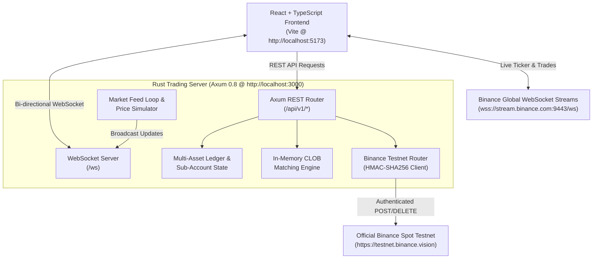

# ⚡ Xtrade | Next-Gen Multi-Asset Crypto Trading Platform & Engine

[](https://www.rust-lang.org/)
[](https://github.com/tokio-rs/axum)
[](https://react.dev/)
[](https://www.typescriptlang.org/)
[](https://vitejs.dev/)
[](https://tailwindcss.com/)
[](https://testnet.binance.vision/)

**Xtrade** is a high-performance, full-stack hybrid cryptocurrency trading platform combining an in-memory **Rust Central Limit Order Book (CLOB) matching engine**, real-time **Binance Spot Testnet order routing**, live **sub-second WebSocket streams**, multi-tier **Spot, Margin, and Leverage trading desks**, an interactive **Binary Options arena**, a dedicated **Web3 Gaming Launchpad (IGO)**, and an institutional **Venture Capital & Token Fundraising Hub**.

---

## 🌟 Key Features

### 1. 📈 Spot, Margin & Leverage Trading Desk (`TradeView.tsx`)
- **Spot Mode**: Real token ownership with 0% liquidation risk.
- **Margin Mode**: Cross-margin borrow power (2x, 3x, 5x, 10x) with real token settlement.
- **Leverage / Futures Mode**: Multiplier sliders (up to 100x) featuring live **Liquidation Price & Safety Buffer** radar.
- **Order Types**: `LIMIT`, `MARKET`, and `STOP_LIMIT` orders.
- **Binance Spot Testnet Router**:
  - Secure **HMAC-SHA256 authenticated API order placement** against `https://testnet.binance.vision/api/v3/order`.
  - Automatic fallback to internal high-speed Rust matching engine when API keys are not provided.
  - Testnet Settings Modal to easily connect free API credentials.
- **1-Click Test Faucet**: Credit virtual test capital (`USDT`, `BTC`, `ETH`, `SOL`, `BNB`) instantly with zero financial risk.
- **Binance 24h Rolling Header & Market Trades**:
  - Top header bar displaying 24h High, 24h Low, 24h Price Change, and 24h Traded Volume.
  - Real-time switchable **Order Book Depth Ladder** and **Binance Market Trades (Time & Sales)** stream.

---

### 2. ⚡ Binary Options Arena (`BinaryView.tsx`)
- High-frequency High/Low strike prediction contracts (30s, 60s, 3m, 5m durations).
- Dynamic payout calculation with up to **92% ROI**.
- Real-time candlestick canvas with animated countdown and live strike settlement.
- Authoritative backend price synchronization against live market feeds.

---

### 3. 🎮 Initial Game Offering (IGO) Launchpad (`IgoView.tsx`)
- Web3 Gaming Launchpad for AAA & indie crypto games built on Unreal Engine 5 and Unity 6 across ImmutableX, Solana, Arbitrum, Avalanche, and BNB Chain.
- **Gaming Guild Staking Tiers**: Scout, Knight Veteran, Champion, and Legend tiers with pool weights, guaranteed allocations, and studio AMA perks.
- **Closed Alpha Passes & Founder Mints**: Early playable builds, alpha tester keys, and exclusive in-game NFT items.
- **Vesting & Token Claim Engine**: Real-time tracking of acquired game tokens with one-click claims to the user's Spot Portfolio.

---

### 4. 🚀 Web3 Venture Capital & Fundraising Hub (`FundraisingView.tsx`)
- Comprehensive radar for tier-1 institutional VC deals, seed rounds, and strategic private placements.
- **Token Unlock & Vesting Schedule Tracker**: Monitor upcoming token unlocks, circulating supply inflation, and high-risk dilution dates.

---

### 5. 💱 Multi-Account Portfolio Ledger & OTC Block Desk
- **Sub-Account Segregation**: Dedicated balances for **Spot Wallet**, **Margin Account**, **Futures / Leverage**, and **Funding / P2P Wallet**.
- **Fiat On-Ramp Integration**: Native support for **Stripe Payment Intents** and **MoonPay** fiat-to-crypto gateways.
- **OTC Block Swaps**: Instant Request-for-Quote (RFQ) engine for large volume token conversions with zero slippage.
- **Real-Time Double-Entry Ledger**: In-memory balance accounting with transaction logging and instant balance updates over WebSocket.

---

## 🏗️ System Architecture



---

## 🛠️ Technology Stack

### Backend
| Technology | Description |
| :--- | :--- |
| **[Rust](https://www.rust-lang.org/)** (2021 Edition) | Blazing-fast, memory-safe systems programming language. |
| **[Axum 0.8](https://github.com/tokio-rs/axum)** | Modular, ergonomic web application framework for Tokio. |
| **[Tokio](https://tokio.rs/)** (1.43) | Asynchronous runtime powering concurrent tasks and timers. |
| **[Tower HTTP](https://github.com/tower-rs/tower-http)** | CORS, tracing, and static SPA file serving middleware. |
| **[Reqwest](https://docs.rs/reqwest)** | Async HTTP client with `rustls-tls` for signing Binance API calls. |
| **[HMAC / SHA-256](https://docs.rs/hmac)** | Cryptographic signature generation for authenticated exchange requests. |
| **[Parking Lot / DashMap](https://docs.rs/parking_lot)** | Ultra-low contention concurrency primitives. |

### Frontend
| Technology | Description |
| :--- | :--- |
| **[React 18](https://react.dev/)** | Component-driven user interface architecture. |
| **[TypeScript 5.7](https://www.typescriptlang.org/)** | End-to-end type safety and structured models. |
| **[Vite 6.1](https://vitejs.dev/)** | Next-generation frontend bundler with sub-second HMR. |
| **[Tailwind CSS 3.4](https://tailwindcss.com/)** | Utility-first styling with comprehensive dark/light mode tokens. |
| **[Lightweight Charts](https://tradingview.github.io/lightweight-charts/)** | High-performance interactive financial charts. |
| **[Lucide React](https://lucide.dev/)** | Consistent, modern icon suite. |

---

## 📂 Project Directory Structure

```
Xtrade/
├── Cargo.toml                 # Rust dependencies & workspace configuration
├── src/                       # Rust Backend Core
│   ├── main.rs                # Entrypoint, route definitions, CORS, server setup
│   ├── state.rs               # Shared thread-safe AppState & config storage
│   ├── models/                # Domain models (Order, Trade, Portfolio, Ticker, Binary)
│   ├── engine/
│   │   ├── mod.rs             # Engine module exporter
│   │   ├── orderbook.rs       # In-memory Central Limit Order Book & matching logic
│   │   ├── ledger.rs          # Multi-asset double-entry balance ledger
│   │   └── binance_router.rs  # HMAC-SHA256 Binance Spot Testnet router client
│   ├── market_feed/           # Market price simulation & broadcast engine
│   └── api/
│       ├── mod.rs             # API module definitions
│       ├── rest.rs            # REST endpoint handlers (/orders, /tickers, /portfolio, etc.)
│       └── ws.rs              # Real-time WebSocket connection handler & broadcaster
└── frontend/                  # React + TypeScript Frontend
    ├── package.json           # Frontend dependencies & build scripts
    ├── vite.config.ts         # Vite server, port 5173, and API proxy configuration
    ├── tailwind.config.js     # Tailwind design system & theme tokens
    └── src/
        ├── App.tsx            # Main application layout, navbar, and view routing
        ├── types/             # TypeScript data contracts & models
        ├── services/
        │   ├── api.ts         # Axios/fetch REST client methods
        │   ├── websocket.ts   # Local WebSocket event dispatcher
        │   └── binanceFeed.ts # Direct Binance WebSocket feed aggregator
        ├── components/        # Reusable UI components & modals
        │   ├── Navbar.tsx     # Global navigation bar with asset ticker & profile drawer
        │   ├── TradingViewChart.tsx # Financial candlestick chart engine
        │   ├── BinaryLiveCanvas.tsx # Real-time Binary Options canvas
        │   └── Modals/        # Deposit, Withdraw, Swap, and Transfer modals
        └── views/             # Core application screens
            ├── TradeView.tsx      # Spot / Margin / Leverage Trading Desk
            ├── BinaryView.tsx     # Binary Options Strike Desk
            ├── IgoView.tsx        # Web3 Gaming Launchpad & Guild Tiers
            ├── FundraisingView.tsx# Token Sales & VC Fundraising Hub
            ├── DashboardView.tsx  # Executive overview & asset distribution
            ├── PortfolioView.tsx  # Multi-account balances & ledger audit
            ├── OtcView.tsx        # High-volume OTC block swaps
            ├── NewsView.tsx       # Real-time market news & economic calendar
            ├── AirdropView.tsx    # Token airdrop eligibility radar
            └── StrategyView.tsx   # Trading academy & strategy guides
```

---

## 🚀 Getting Started

### Prerequisites
Make sure you have the following installed on your machine:
- **[Rust & Cargo](https://rustup.rs/)** (v1.75 or newer)
- **[Node.js](https://nodejs.org/)** (v18 or newer)
- **[npm](https://www.npmjs.com/)** or **[pnpm](https://pnpm.io/)**

---

### Installation & Local Setup

1. **Clone the Repository**:
   ```bash
   git clone https://github.com/your-username/Xtrade.git
   cd Xtrade
   ```

2. **Install Frontend Dependencies**:
   ```bash
   cd frontend
   npm install
   cd ..
   ```

3. **Start the Rust Backend Server**:
   ```bash
   # Runs on http://localhost:3000
   cargo run
   ```

4. **Start the Vite Frontend Development Server** (in a second terminal):
   ```bash
   cd frontend
   # Runs on http://localhost:5173 with automatic proxying to :3000
   npm run dev
   ```

5. **Open the Application**:
   - **Frontend UI**: [http://localhost:5173](http://localhost:5173)
   - **Backend API**: [http://localhost:3000](http://localhost:3000)

---

## 📡 REST API & WebSocket Reference

### Core REST Endpoints

| Method | Route | Description |
| :--- | :--- | :--- |
| `GET` | `/api/v1/market/tickers` | Returns 24h statistics and current prices for all pairs. |
| `POST` | `/api/v1/market/ticker-sync` | Synchronizes authoritative live ticker prices. |
| `GET` | `/api/v1/market/depth?symbol=BTC/USDT` | Retrieves live order book depth (bids & asks). |
| `GET` | `/api/v1/market/klines?symbol=BTC/USDT` | Retrieves historical candlestick data for charts. |
| `GET` | `/api/v1/portfolio` | Retrieves user equity, available balances, and sub-accounts. |
| `POST` | `/api/v1/portfolio/test-deposit` | Faucet endpoint to credit test tokens (`USDT`, `BTC`, `ETH`). |
| `GET` | `/api/v1/orders` | Lists active working orders and executions. |
| `POST` | `/api/v1/orders` | Places a new `LIMIT`, `MARKET`, or `STOP_LIMIT` order. |
| `DELETE` | `/api/v1/orders/:id` | Cancels an active working order. |
| `GET` | `/api/v1/trades` | Retrieves recent filled transactions. |
| `GET` | `/api/v1/binance/config` | Gets current Binance Testnet router status and masked keys. |
| `POST` | `/api/v1/binance/config` | Updates Binance Testnet API key, secret, and routing toggle. |
| `POST` | `/api/v1/binary/place` | Places a Binary Options contract (`HIGH` or `LOW`). |
| `GET` | `/api/v1/binary/contracts` | Lists active and historical binary options contracts. |
| `POST` | `/api/v1/otc/quote` | Requests an instant OTC swap quote. |
| `POST` | `/api/v1/otc/swap` | Executes an OTC block swap. |

### Real-Time WebSocket (`/ws`)
Connect via `ws://localhost:3000/ws` to receive event streams:
- `TickerUpdate`: Real-time price fluctuations and 24h rolling metrics.
- `DepthUpdate`: Incremental order book updates.
- `KlineUpdate`: Real-time chart candle updates.
- `OrderUpdate`: Order placement, fill, and cancellation state transitions.
- `PortfolioUpdate`: Real-time balance and equity updates.

---

## 🛡️ Binance Spot Testnet Integration

Xtrade supports direct routing to Binance's official Testnet with zero financial cost:
1. Visit [testnet.binance.vision](https://testnet.binance.vision/) and log in with your GitHub account.
2. Click **Generate HMAC_SHA256 Key**.
3. In the Xtrade Trade Desk header, click **`[ 🟢 Binance Testnet / ⚡ Local Engine ]`**.
4. Paste your **API Key** and **Secret Key**, toggle **Enable Binance Testnet Routing**, and click **Save Configuration**.
5. Orders placed on `BTC/USDT`, `ETH/USDT`, `SOL/USDT`, etc. will match against real Binance Testnet liquidity.

---

## 📦 Production Build

To build the static frontend for deployment:
```bash
cd frontend
npm run build
```
The compiled SPA bundle will be placed in `frontend/dist/`. The Rust backend is pre-configured to automatically serve `frontend/dist` when accessed directly at `http://localhost:3000`.

---

## 📄 License

This project is licensed under the **MIT License** — see the [LICENSE](LICENSE) file for details.

---

<div align="center">
  <sub>Built with ❤️ by the Xtrade Engineering Team. High-speed, secure, and decentralized.</sub>
</div>
